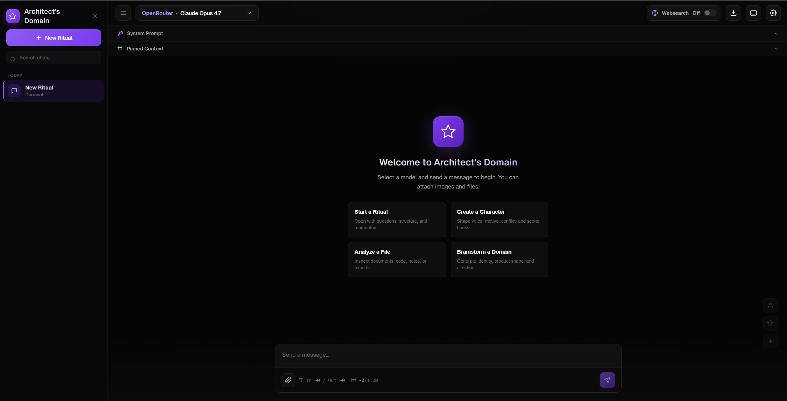

## Architect's Domain

**Local-first • Multi-model • BYOAK AI Workstation for Power Users**



> A privacy-first, hackable AI cockpit that lets you switch between frontier models instantly, maintain persistent memory across chats, and experiment freely — all while keeping your API keys and data under your control.

**Status:** Public Beta • Actively evolving

---

## ✨ Why Architect's Domain?

Most AI chat tools force you into one ecosystem. Architect's Domain is different:

- **True local-first** — runs anywhere (GitHub Pages, Netlify, localhost, even offline with local models)
- **BYOAK (Bring Your Own API Keys)** — zero backend, zero secrets in the repo
- **Multi-provider freedom** — OpenRouter, Venice.ai, DeepSeek, and soon Ollama / LM Studio
- **Persistent contextual memory** — pin important context that follows you across every model and conversation
- **Built for power users** — prompt engineers, roleplay creators, researchers, and tinkerers

No accounts. No tracking. No vendor lock-in.

---

## 🚀 Quick Start

### Option 1: Try it instantly (Recommended for first time)
1. Visit the live demo (GitHub Pages link coming soon)
2. Add your API keys in Settings
3. Start chatting with pinned memory enabled

### Option 2: Run locally
```bash
git clone https://github.com/HactoriXD/architects-domain.git
cd architects-domain
# Simple local server
python -m http.server 8000
# or use the included server.js
node server.js
```
Then open http://localhost:8000

### Option 3: Deploy anywhere static
- GitHub Pages
- Netlify (drag & drop)
- Cloudflare Pages
- Vercel

---

## ✨ Core Features

### Multi-Provider Support
- OpenRouter
- Venice.ai
- DeepSeek
- *Coming soon:* Ollama, LM Studio, Groq, Anthropic (via compatible endpoints)

### BYOAK Architecture
- API keys stored only in your browser (localStorage)
- Keys never leave your device except to the provider you choose
- Easy key management UI with validation

### Intelligent Memory System
- Per-chat **pinned memory** that is silently injected into every request
- Works across all providers and models
- Future: semantic search, memory decay, branching conversations

### Streaming & UX
- Smooth buffered SSE streaming
- Safe chat switching mid-generation
- Preserved partial outputs when stopping
- Advanced markdown with syntax highlighting and code blocks

### Cockpit Workflow
- Multi-chat navigation
- Keyboard shortcuts everywhere
- Export / import conversations
- Pinned context controls

### Local-First Philosophy
- Fully static — no database, no auth server required
- Portable single-folder app
- Hackable and forkable

---

## 🗺️ Roadmap

### v0.2 — Polish & Power Tools (Next 2–4 weeks)
- [ ] Overhauled settings & provider management UI
- [ ] Per-chat model overrides + smart router
- [ ] Conversation branching & tree view
- [ ] SillyTavern character card import/export
- [ ] Keyboard shortcut overlay + full documentation
- [ ] Better onboarding & first-run experience
- [ ] Desktop wrapper (Tauri)

### v0.3 — Intelligence Layer (1–2 months)
- [ ] Context window awareness + auto-summarization
- [ ] Local model support (Ollama / LM Studio native)
- [ ] Prompt template library + A/B testing mode
- [ ] Semantic memory search (browser embeddings)
- [ ] Image upload + vision model routing

### v1.0 — Production Ready (Q3 2026)
- [ ] Theming system + focus modes
- [ ] Full PWA + offline support
- [ ] Comprehensive documentation & video tutorials
- [ ] Plugin/extension system
- [ ] Public release + community features

**Want to influence the roadmap?** Open an issue or join the discussion!

---

## 🛠️ Development

### Tech Stack
- **Frontend**: Vanilla HTML + CSS + JavaScript (deliberately lightweight)
- **Architecture**: Modular (`/styles`, `/scripts`, core files)
- **No heavy frameworks** — maximum portability and hackability

### Project Structure
```
architects-domain/
├── index.html          # Main application
├── server.js           # Optional local dev server
├── package.json
├── styles/             # CSS modules
├── scripts/            # JS modules (providers, memory, ui, etc.)
├── assets/             # Images, icons
├── .env.example
└── README.md
```

### Local Development
```bash
# Clone and run
node server.js
# or any static server
```

### Contributing
We welcome contributions! See [CONTRIBUTING.md](CONTRIBUTING.md) (coming soon).

Good first issues will be labeled `good first issue`.

---

## 🔒 Security & Privacy

- **Strict BYOAK** — your keys never touch our servers (there are none)
- Keys live only in browser localStorage
- All communication goes directly from your browser to the AI provider
- No analytics, no telemetry, no accounts
- Open source — audit everything

**Note:** LocalStorage is convenient but not encrypted. For maximum security, consider clearing keys after use or using a password manager extension.

---

## 📜 License

MIT License — see [LICENSE](LICENSE) file.

---

## ❤️ Acknowledgments

Inspired by the best ideas from SillyTavern, Oobabooga, and the broader local AI community.

Special thanks to everyone building open, user-controlled AI tools.

---

**Built with ❤️ for power users who refuse to be locked in.**

*Last updated: May 2026*